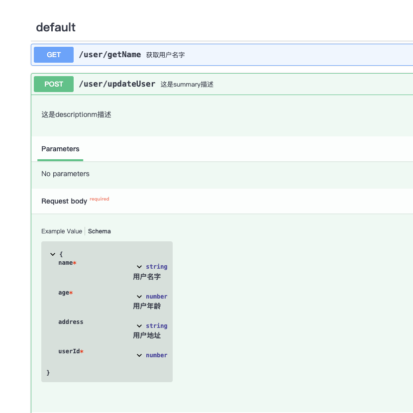
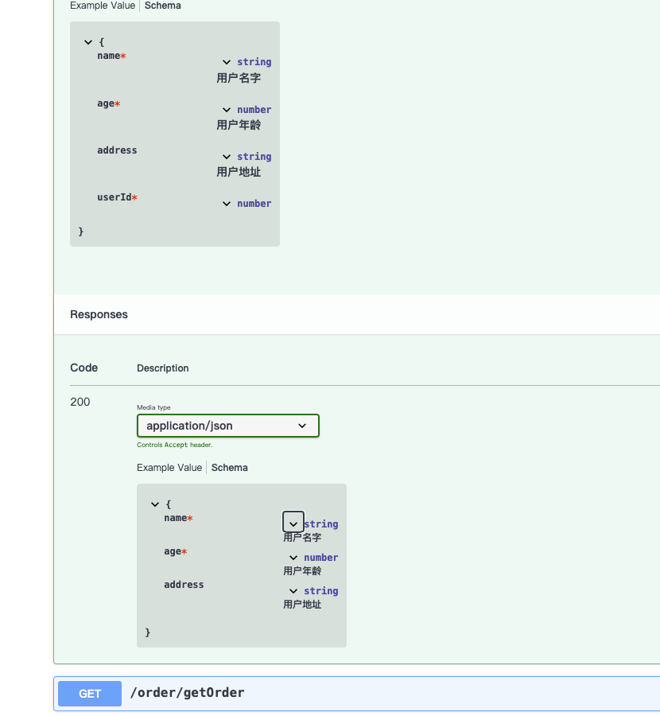

## @typescript-generate-swagger/swagger-tegg
只支持egg.js的tegg版本。通过typescript的类型定义,自动生成swaggger文档。   
通过读取带controller标识的文件名来获取tegg的controller（userController.ts）   
Only the tegg version of egg.js is supported.    
Automatically generate swagger documents with typescript type definitions and javascript comments

### install 
```
  npm install @typescript-generate-swagger/swagger-tegg --save-dev
```

### usage

```
const  { swaggerTegg } = require("@typescript-generate-swagger/swagger-tegg")
const path = require('path');
swaggerTegg({
  projectDir: path.join(__dirname, '../'),  //项目目录
  outPutL: __dirname,   //swagger.json输出地址
  outFile: 'swagger.json'  //swagger.json的文件名
  swaggerConfig:{},  //swaggerDoc的配置替换
})

```
### result  



### example
[示例地址](packages/swagger-tegg/example)
```
  type User = {
    name: string  //用户名字
    age: number  //用户年龄
    /** 用户地址 */
    address?: string
  }

  @HTTPController({path:'/user'})
  export class UserController {
    /**
    * @summary   获取用户名字
    * @description  这是descriptionm描述
    */
    @HTTPMethod({
      method: HTTPMethodEnum.GET,
      path: '/getName',
    })
    async getName(@Context() ctx: EggContext, /** 用户id */ @HTTPQuery() userId: number ){
      let query = ctx.query as {
        name: string //这是  queryObj中的描述
      }
      let userInfo = {
        /** 这是对象上的注释egg */
        name: 'egg',  
        age: 18, //这是对象上的注释
      }    
      return  userInfo
    }

    /**
    * @summary 这是summary描述
    * @description  这是descriptionm描述
    */
    @HTTPMethod({
      method: HTTPMethodEnum.POST,
      path: '/updateUser',
    })
    async updateUser(@Context() ctx: EggContext, @HTTPBody() body: User & {userId: number }){
      let user:User = {
        name: 'egg',
        age: 20,
        address: '北京',  
      }
      return user
    }
  }

```
##### http方法描述
  每个http方法上面加注释
  ```
    /**
    * @summary 这是summary描述
    * @description  这是descriptionm描述
    */
  ```
##### query
两种形式  
1. 函数上面的参数
  ```
     async getName(@Context() ctx: EggContext, /** 用户id */ @HTTPQuery() userId: number ){
  ```
2. 函数体里面添加类型
```
  let query = ctx.query as {   
    name: string //这是  queryObj中的描述   
  }
```